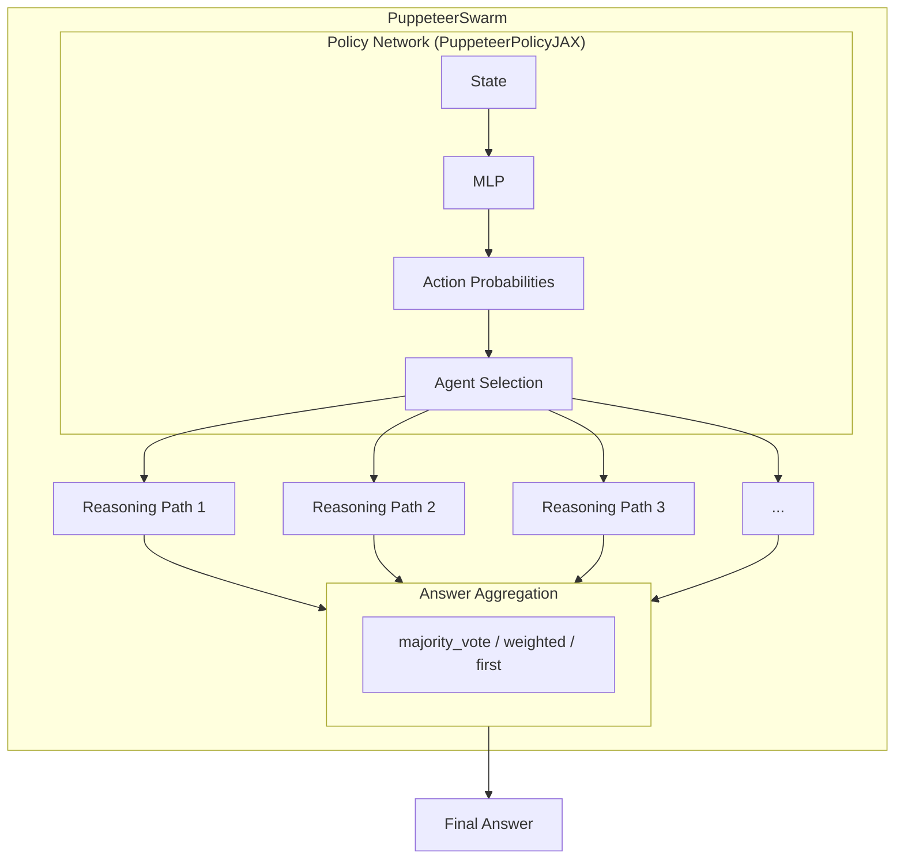
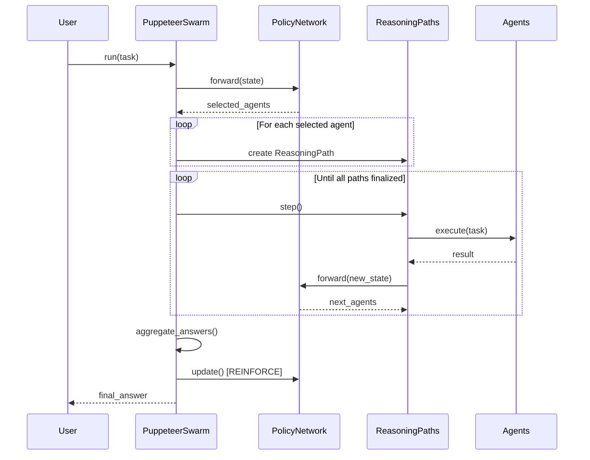

# PuppeteerSwarm

**Dynamic Orchestration Multi-Agent System**

A centralized policy network (puppeteer) that dynamically selects and sequences specialized agents based on evolving task states, with reinforcement learning to optimize both effectiveness and efficiency.

---

## Table of Contents

- [Overview](#overview)
- [Architecture](#architecture)
- [Installation](#installation)
- [Quick Start](#quick-start)
- [Core Components](#core-components)
  - [PuppeteerSwarm](#puppeteerswarm-class)
  - [PuppeteerPolicyJAX](#puppeteerpolicyjax)
  - [StateEncoder](#stateencoder)
  - [ReasoningPath](#reasoningpath)
  - [RewardCalculator](#rewardcalculator)
  - [WorkflowTracker](#workflowtracker)
- [Configuration Options](#configuration-options)
- [Advanced Usage](#advanced-usage)
- [API Reference](#api-reference)
- [Dependencies](#dependencies)

---

## Overview

PuppeteerSwarm implements a novel approach to multi-agent orchestration where a central "puppeteer" policy network learns to dynamically select and sequence specialized agents based on the evolving state of a task. Unlike static pipelines, the puppeteer adapts its agent selection strategy through reinforcement learning (REINFORCE algorithm), optimizing for both task correctness and computational efficiency.

### Key Features

- **Dynamic Agent Selection**: Policy network selects agents based on current task state
- **Parallel Reasoning Paths**: Explore multiple solution strategies simultaneously
- **Reinforcement Learning**: REINFORCE algorithm optimizes agent selection over time
- **Reward Model Integration**: Optional transformer-based state encoding for rich representations
- **Flexible Aggregation**: Multiple strategies for combining results from parallel paths
- **Graph Visualization**: Track and visualize agent interaction patterns

---

## Architecture



### Execution Flow



---

## Installation

### Prerequisites

- Python 3.9+ (Python 3.11 or 3.12 recommended for Flax compatibility)
- JAX with CPU or GPU support

### Install Dependencies

```bash
pip install -r requirements.txt
```

### Optional Dependencies

For reward model-based state encoding:
```bash
pip install transformers torch
```

For graph visualization:
```bash
pip install networkx matplotlib
```

---

## Quick Start

```python
from swarms.structs.agent import Agent
from puppeteer import PuppeteerSwarm

# Define specialized agents
researcher = Agent(
    agent_name="Researcher",
    system_prompt="You are a research specialist. Analyze and gather information."
)

analyst = Agent(
    agent_name="Analyst",
    system_prompt="You are an analytical expert. Process and interpret data."
)

writer = Agent(
    agent_name="Writer",
    system_prompt="You are a professional writer. Synthesize findings into clear output."
)

# Create PuppeteerSwarm
swarm = PuppeteerSwarm(
    agents=[researcher, analyst, writer],
    name="ResearchSwarm",
    max_parallel_paths=2,
    max_steps=5,
    enable_training=True,
    verbose=True
)

# Run a task
result = swarm.run("Analyze the impact of AI on healthcare and summarize key findings.")
print(result)
```

---

## Core Components

### PuppeteerSwarm Class

The main orchestrator that manages multiple parallel reasoning paths and coordinates execution using the centralized policy network.

```python
class PuppeteerSwarm(BaseSwarm):
    def __init__(
        self,
        agents: List[Union[Agent, Callable]],
        name: Optional[str] = "PuppeteerSwarm",
        description: Optional[str] = "Dynamic orchestration multi-agent system",
        max_parallel_paths: int = 4,
        max_steps: int = 10,
        enable_training: bool = True,
        state_dim: int = 8192,
        use_reward_model: bool = True,
        reward_model_name: Optional[str] = None,
        learning_rate: float = 0.0001,
        gamma: float = 0.99,
        max_agents_per_step: int = 3,
        aggregation_method: str = "majority_vote",
        correctness_evaluator: Optional[Callable] = None,
        verbose: bool = False
    )
```

#### Methods

| Method | Description |
|--------|-------------|
| `run(task: str) -> str` | Main execution loop. Starts reasoning, steps through paths, and finalizes. |
| `start(task: str)` | Initialize reasoning with policy-selected initial agents. |
| `step()` | Execute one step across all active paths. |
| `finalize() -> str` | Aggregate results, calculate rewards, and update policy. |
| `visualize_graph(output_path: Optional[str])` | Visualize agent interaction graph. |

---

### PuppeteerPolicyJAX

JAX+Flax-based MLP policy network that learns optimal agent selection through REINFORCE.

```python
class PuppeteerPolicyJAX(PuppeteerPolicyBase):
    def __init__(
        self,
        state_dim: int,
        action_dim: int,
        hidden_layers: List[int] = [512, 128, 32],
        learning_rate: float = 0.0001,
        gamma: float = 0.99,
        max_agents_per_step: int = 3,
        selection_threshold: Optional[float] = None
    )
```

#### Key Features

- **MLP Architecture**: Configurable hidden layers for flexible capacity
- **Threshold Selection**: Select multiple agents when probabilities exceed threshold
- **REINFORCE Updates**: Policy gradient updates with discounted returns

---

### StateEncoder

Encodes workflow state into fixed-size vectors for the policy network.

```python
class StateEncoder:
    def __init__(
        self,
        reward_model_name: Optional[str] = None,
        state_dim: int = 8192,
        use_reward_model: bool = True,
        device: str = "cpu"
    )
```

#### Encoding Methods

1. **Reward Model Encoding** (Primary): Uses transformer hidden states for rich semantic representations
2. **Simple Encoding** (Fallback): Character-based concatenation encoding

---

### ReasoningPath

Tracks a single reasoning path through the agent sequence.

```python
class ReasoningPath:
    def __init__(
        self,
        path_id: str,
        policy: Any,
        workflow_tracker: WorkflowTracker,
        global_info: Dict[str, Any],
        max_steps: int = 10
    )
```

#### Path States

| State | Description |
|-------|-------------|
| `INITIALIZED` | Path created but not yet started |
| `ACTIVE` | Path is actively executing |
| `SPLITTING` | Path selected multiple agents, will split |
| `FINALIZED` | Path completed execution |
| `DISCARDED` | Path abandoned |

---

### RewardCalculator

Calculates rewards for REINFORCE training with configurable components.

```python
class RewardCalculator:
    def __init__(
        self,
        correctness_weight: float = 1.0,
        step_penalty_scale: float = 1.0,
        token_cost_scale: float = 0.001,
        agent_factors: Optional[Dict[str, float]] = None,
        max_steps: int = 10,
        growth_rate: float = 10.0
    )
```

#### Reward Formula

```
reward = correctness_reward - step_cost - token_cost + agent_factor
```

Where:
- `correctness_reward`: +weight if correct, -weight if incorrect
- `step_cost`: Logarithmic penalty for number of steps
- `token_cost`: Linear penalty for token usage
- `agent_factor`: Agent-specific bonus/penalty

---

### WorkflowTracker

Tracks action history and state transitions throughout execution.

```python
class WorkflowTracker:
    def add_action(
        self,
        agent: Union[str, Agent],
        action: str,
        result: str,
        success: bool = True,
        cost: float = 0.0,
        tokens: int = 0
    )
```

---

## Configuration Options

### Aggregation Methods

| Method | Description |
|--------|-------------|
| `majority_vote` | Select most common answer (default) |
| `weighted` | Select answer from highest-reward path |
| `first` | Select first completed answer |

### Training Parameters

| Parameter | Default | Description |
|-----------|---------|-------------|
| `learning_rate` | 0.0001 | Adam optimizer learning rate |
| `gamma` | 0.99 | Discount factor for returns |
| `enable_training` | True | Enable policy updates |

### Execution Parameters

| Parameter | Default | Description |
|-----------|---------|-------------|
| `max_parallel_paths` | 4 | Maximum concurrent reasoning paths |
| `max_steps` | 10 | Maximum steps per path |
| `max_agents_per_step` | 3 | Maximum agents selected per step |

---

## Advanced Usage

### Custom Correctness Evaluator

```python
def my_evaluator(answer: str, task: str) -> bool:
    """Custom logic to evaluate answer correctness."""
    return "expected_keyword" in answer.lower()

swarm = PuppeteerSwarm(
    agents=my_agents,
    correctness_evaluator=my_evaluator,
    enable_training=True
)
```

### Agent-Specific Reward Factors

```python
from puppeteer import RewardCalculator

calculator = RewardCalculator(
    agent_factors={
        "web_search": -1.5,    # Penalize expensive operations
        "terminator": 0.5,     # Reward clean termination
        "analyzer": -0.5,      # Slight penalty for complex agents
        "default": -1.0
    }
)
```

### Visualizing Agent Graphs

```python
swarm = PuppeteerSwarm(agents=my_agents)
swarm.run("My task")

# Save to file
swarm.visualize_graph(output_path="agent_graph.png")

# Display interactively
swarm.visualize_graph()
```

---

## API Reference

### PuppeteerSwarm

```python
PuppeteerSwarm(
    agents: List[Union[Agent, Callable]],  # Required: List of agents
    name: Optional[str],                    # Swarm name
    description: Optional[str],             # Swarm description
    max_parallel_paths: int,                # Max concurrent paths
    max_steps: int,                         # Max steps per path
    enable_training: bool,                  # Enable REINFORCE updates
    state_dim: int,                         # State encoding dimension
    use_reward_model: bool,                 # Use transformer encoding
    reward_model_name: Optional[str],       # HuggingFace model name
    learning_rate: float,                   # Policy learning rate
    gamma: float,                           # Discount factor
    max_agents_per_step: int,               # Max agents per selection
    aggregation_method: str,                # Answer aggregation method
    correctness_evaluator: Optional[Callable],  # Custom evaluator
    verbose: bool                           # Enable verbose logging
)
```

### PathState Enum

```python
class PathState(str, Enum):
    INITIALIZED = "initialized"
    ACTIVE = "active"
    SPLITTING = "splitting"
    FINALIZED = "finalized"
    DISCARDED = "discarded"
```

---

## Dependencies

### Required

| Package | Version | Purpose |
|---------|---------|---------|
| `numpy` | >=1.21.0 | Numerical operations |
| `jax` | >=0.4.0 | Automatic differentiation |
| `jaxlib` | >=0.4.0 | JAX backend |
| `flax` | >=0.7.0 | Neural network library |
| `optax` | >=0.1.0 | Optimization library |
| `swarms` | >=2.0.0 | Base agent framework |

### Optional

| Package | Version | Purpose |
|---------|---------|---------|
| `transformers` | >=4.30.0 | Reward model encoding |
| `torch` | >=2.0.0 | Transformer backend |
| `networkx` | >=3.0 | Graph operations |
| `matplotlib` | >=3.7.0 | Visualization |

---

## License

This module is part of the Euroswarm project.

---

## Contributing

Contributions are welcome. Please ensure code follows the project's style guidelines:

- Type annotations on all functions
- Docstrings in Google style
- Logging with Loguru
- Clean, modular code structure
