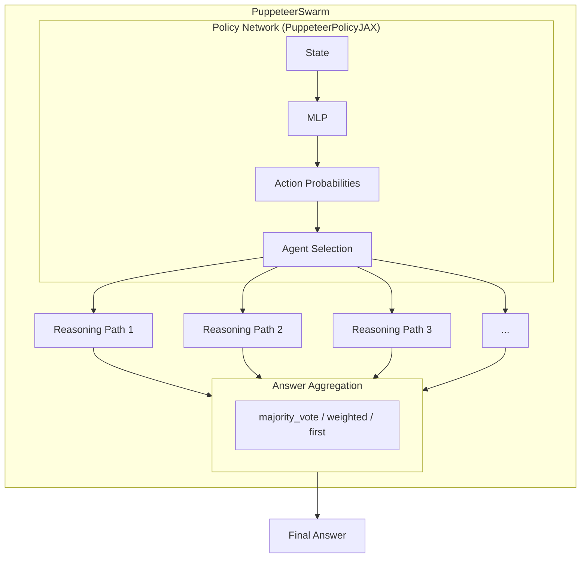
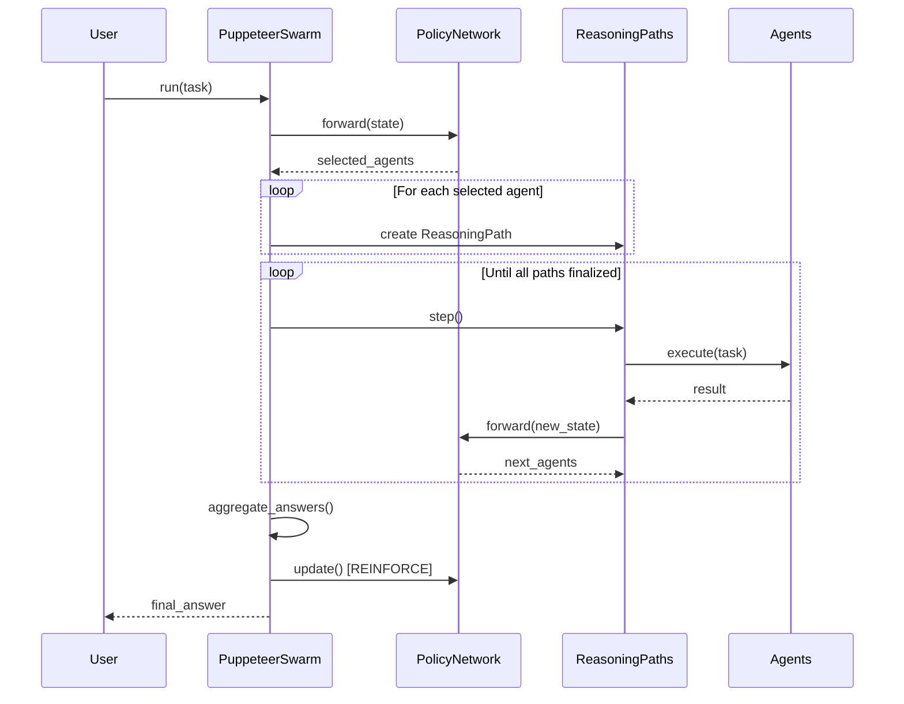
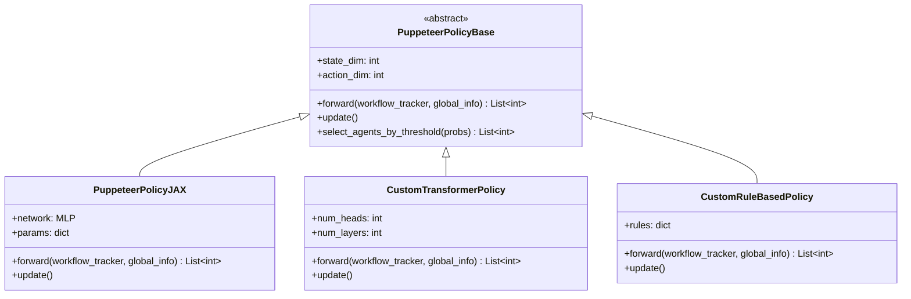
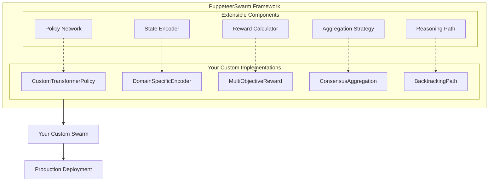

# PuppeteerSwarm

**Dynamic Orchestration Multi-Agent System**

A centralized policy network (puppeteer) that dynamically selects and sequences specialized agents based on evolving task states, with reinforcement learning to optimize both effectiveness and efficiency.

---

## Table of Contents

- [Overview](#overview)
- [Architecture](#architecture)
- [Installation](#installation)
- [Quick Start](#quick-start)
- [Creating Swarms](#creating-swarms)
  - [Basic Swarm Patterns](#basic-swarm-patterns)
  - [Domain-Specific Swarms](#domain-specific-swarms)
  - [Production Swarms](#production-swarms)
- [Building as a Framework](#building-as-a-framework)
  - [Custom Policy Networks](#custom-policy-networks)
  - [Custom State Encoders](#custom-state-encoders)
  - [Custom Reward Functions](#custom-reward-functions)
  - [Custom Aggregation Strategies](#custom-aggregation-strategies)
  - [Extending ReasoningPath](#extending-reasoningpath)
- [Core Components](#core-components)
  - [PuppeteerSwarm](#puppeteerswarm-class)
  - [PuppeteerPolicyJAX](#puppeteerpolicyjax)
  - [StateEncoder](#stateencoder)
  - [ReasoningPath](#reasoningpath)
  - [RewardCalculator](#rewardcalculator)
  - [WorkflowTracker](#workflowtracker)
- [Configuration Options](#configuration-options)
- [Advanced Usage](#advanced-usage)
- [API Reference](#api-reference)
- [Dependencies](#dependencies)

---

## Overview

PuppeteerSwarm implements a novel approach to multi-agent orchestration where a central "puppeteer" policy network learns to dynamically select and sequence specialized agents based on the evolving state of a task. Unlike static pipelines, the puppeteer adapts its agent selection strategy through reinforcement learning (REINFORCE algorithm), optimizing for both task correctness and computational efficiency.

### Key Features

- **Dynamic Agent Selection**: Policy network selects agents based on current task state
- **Parallel Reasoning Paths**: Explore multiple solution strategies simultaneously
- **Reinforcement Learning**: REINFORCE algorithm optimizes agent selection over time
- **Reward Model Integration**: Optional transformer-based state encoding for rich representations
- **Flexible Aggregation**: Multiple strategies for combining results from parallel paths
- **Graph Visualization**: Track and visualize agent interaction patterns

---

## Architecture



### Execution Flow



---

## Installation

### Prerequisites

- Python 3.9+ (Python 3.11 or 3.12 recommended for Flax compatibility)
- JAX with CPU or GPU support

### Install Dependencies

```bash
pip install -r requirements.txt
```

### Optional Dependencies

For reward model-based state encoding:
```bash
pip install transformers torch
```

For graph visualization:
```bash
pip install networkx matplotlib
```

---

## Quick Start

```python
from swarms.structs.agent import Agent
from puppeteer import PuppeteerSwarm

# Define specialized agents
researcher = Agent(
    agent_name="Researcher",
    system_prompt="You are a research specialist. Analyze and gather information."
)

analyst = Agent(
    agent_name="Analyst",
    system_prompt="You are an analytical expert. Process and interpret data."
)

writer = Agent(
    agent_name="Writer",
    system_prompt="You are a professional writer. Synthesize findings into clear output."
)

# Create PuppeteerSwarm
swarm = PuppeteerSwarm(
    agents=[researcher, analyst, writer],
    name="ResearchSwarm",
    max_parallel_paths=2,
    max_steps=5,
    enable_training=True,
    verbose=True
)

# Run a task
result = swarm.run("Analyze the impact of AI on healthcare and summarize key findings.")
print(result)
```

---

## Creating Swarms

This section provides practical patterns for building swarms tailored to different use cases.

### Basic Swarm Patterns

#### Sequential Processing Swarm

For tasks that benefit from step-by-step processing with potential branching:

```python
from swarms.structs.agent import Agent
from puppeteer import PuppeteerSwarm

# Define agents for a data pipeline
ingester = Agent(
    agent_name="DataIngester",
    system_prompt="Extract and validate raw data from the input. Output structured data."
)

transformer = Agent(
    agent_name="DataTransformer", 
    system_prompt="Transform and normalize the data. Apply business rules."
)

validator = Agent(
    agent_name="DataValidator",
    system_prompt="Validate data integrity and flag anomalies."
)

outputter = Agent(
    agent_name="DataOutputter",
    system_prompt="Format and present the final processed data. Say 'TASK COMPLETE' when done."
)

pipeline_swarm = PuppeteerSwarm(
    agents=[ingester, transformer, validator, outputter],
    name="DataPipeline",
    max_parallel_paths=1,  # Sequential processing
    max_steps=4,
    enable_training=True
)
```

#### Parallel Exploration Swarm

For tasks requiring multiple perspectives or approaches:

```python
# Define diverse reasoning agents
optimist = Agent(
    agent_name="OptimistAnalyst",
    system_prompt="Analyze from a positive perspective. Identify opportunities and benefits."
)

pessimist = Agent(
    agent_name="PessimistAnalyst", 
    system_prompt="Analyze from a critical perspective. Identify risks and challenges."
)

pragmatist = Agent(
    agent_name="PragmatistAnalyst",
    system_prompt="Analyze from a practical perspective. Focus on feasibility and implementation."
)

synthesizer = Agent(
    agent_name="Synthesizer",
    system_prompt="Combine multiple perspectives into a balanced conclusion. Say 'FINAL ANSWER' when done."
)

exploration_swarm = PuppeteerSwarm(
    agents=[optimist, pessimist, pragmatist, synthesizer],
    name="PerspectiveExplorer",
    max_parallel_paths=3,  # Explore multiple paths simultaneously
    max_steps=6,
    aggregation_method="weighted",  # Best path wins
    enable_training=True
)
```

### Domain-Specific Swarms

#### Code Review Swarm

```python
security_reviewer = Agent(
    agent_name="SecurityReviewer",
    system_prompt="""You are a security expert. Review code for:
    - SQL injection vulnerabilities
    - XSS vulnerabilities  
    - Authentication/authorization issues
    - Sensitive data exposure
    Output findings in structured format."""
)

performance_reviewer = Agent(
    agent_name="PerformanceReviewer",
    system_prompt="""You are a performance optimization expert. Review code for:
    - Time complexity issues
    - Memory leaks
    - Inefficient algorithms
    - Database query optimization
    Output findings with severity ratings."""
)

style_reviewer = Agent(
    agent_name="StyleReviewer",
    system_prompt="""You are a code quality expert. Review code for:
    - Naming conventions
    - Code organization
    - Documentation completeness
    - Design pattern usage
    Output actionable improvement suggestions."""
)

report_generator = Agent(
    agent_name="ReportGenerator",
    system_prompt="Compile all review findings into a comprehensive code review report. Say 'REVIEW COMPLETE' when done."
)

code_review_swarm = PuppeteerSwarm(
    agents=[security_reviewer, performance_reviewer, style_reviewer, report_generator],
    name="CodeReviewSwarm",
    max_parallel_paths=3,
    max_steps=8,
    enable_training=True
)
```

#### Research Assistant Swarm

```python
literature_searcher = Agent(
    agent_name="LiteratureSearcher",
    system_prompt="Search and identify relevant academic sources, papers, and publications on the given topic."
)

fact_checker = Agent(
    agent_name="FactChecker",
    system_prompt="Verify claims and cross-reference information across multiple sources. Flag uncertainties."
)

summarizer = Agent(
    agent_name="Summarizer",
    system_prompt="Create concise summaries of complex information while preserving key details."
)

citation_manager = Agent(
    agent_name="CitationManager",
    system_prompt="Format citations properly and maintain bibliography. Track source reliability."
)

research_writer = Agent(
    agent_name="ResearchWriter",
    system_prompt="Synthesize research into well-structured academic writing. Say 'RESEARCH COMPLETE' when finished."
)

research_swarm = PuppeteerSwarm(
    agents=[literature_searcher, fact_checker, summarizer, citation_manager, research_writer],
    name="ResearchAssistant",
    max_parallel_paths=2,
    max_steps=10,
    aggregation_method="weighted",
    enable_training=True
)
```

### Production Swarms

#### With Custom Evaluation

```python
import re

def quality_evaluator(answer: str, task: str) -> bool:
    """Evaluate answer quality based on multiple criteria."""
    if not answer or len(answer) < 50:
        return False
    
    # Check for completion markers
    completion_markers = ["complete", "final answer", "conclusion", "done"]
    has_completion = any(marker in answer.lower() for marker in completion_markers)
    
    # Check for structured output
    has_structure = bool(re.search(r'(\d+\.|[-*]|\n\n)', answer))
    
    # Check relevance (simple keyword overlap)
    task_words = set(task.lower().split())
    answer_words = set(answer.lower().split())
    relevance = len(task_words & answer_words) / len(task_words) if task_words else 0
    
    return has_completion and has_structure and relevance > 0.2

production_swarm = PuppeteerSwarm(
    agents=my_agents,
    name="ProductionSwarm",
    max_parallel_paths=4,
    max_steps=15,
    correctness_evaluator=quality_evaluator,
    enable_training=True,
    learning_rate=0.0005,
    gamma=0.95
)
```

#### With Monitoring and Logging

```python
from loguru import logger

class MonitoredSwarm(PuppeteerSwarm):
    """Production swarm with built-in monitoring."""
    
    def run(self, task: str) -> str:
        logger.info(f"Starting task: {task[:100]}...")
        
        try:
            result = super().run(task)
            
            # Log metrics
            logger.info(f"Completed with {len(self.reasoning_paths)} paths")
            logger.info(f"Final answer length: {len(result)} chars")
            
            for i, path in enumerate(self.reasoning_paths):
                logger.debug(f"Path {i}: {path.agent_sequence} -> reward: {path.reward}")
            
            return result
            
        except Exception as e:
            logger.error(f"Task failed: {e}")
            raise

monitored_swarm = MonitoredSwarm(
    agents=my_agents,
    name="MonitoredProduction",
    max_parallel_paths=3,
    max_steps=10,
    enable_training=True
)
```

---

## Building as a Framework

PuppeteerSwarm is designed to be extensible. This section shows how to customize and extend each component.

### Custom Policy Networks

Create your own policy network by extending `PuppeteerPolicyBase`:

```python
from puppeteer import PuppeteerPolicyBase, WorkflowTracker
from typing import Dict, Any, List, Optional
import numpy as np

class CustomTransformerPolicy(PuppeteerPolicyBase):
    """Custom policy using transformer architecture."""
    
    def __init__(
        self,
        state_dim: int,
        action_dim: int,
        num_heads: int = 8,
        num_layers: int = 4,
        learning_rate: float = 0.0001,
        gamma: float = 0.99,
        max_agents_per_step: int = 3,
        selection_threshold: Optional[float] = None
    ):
        super().__init__(state_dim, action_dim, learning_rate, gamma, 
                         max_agents_per_step, selection_threshold)
        self.num_heads = num_heads
        self.num_layers = num_layers
        self._initialize_transformer()
    
    def _initialize_transformer(self):
        """Initialize your transformer architecture here."""
        # Example: Use your preferred deep learning framework
        # self.model = TransformerEncoder(...)
        pass
    
    def forward(self, workflow_tracker: WorkflowTracker, global_info: Dict[str, Any]) -> List[int]:
        """Select agents based on current state using transformer."""
        # Encode state
        state = self._encode_state(workflow_tracker, global_info)
        
        # Get action probabilities from transformer
        # action_probs = self.model(state)
        action_probs = np.random.dirichlet(np.ones(self.action_dim))  # Placeholder
        
        return self.select_agents_by_threshold(action_probs)
    
    def _encode_state(self, workflow_tracker: WorkflowTracker, global_info: Dict[str, Any]) -> np.ndarray:
        """Encode workflow state for transformer input."""
        # Custom encoding logic
        history = workflow_tracker.get_workflow_history()
        # Transform to sequence representation
        return np.zeros((1, self.state_dim))  # Placeholder
    
    def update(self):
        """Update policy using your training algorithm."""
        # Implement PPO, A2C, or other RL algorithms
        pass

# Use custom policy in swarm
class CustomPolicySwarm(PuppeteerSwarm):
    def __init__(self, agents, **kwargs):
        super().__init__(agents, **kwargs)
        # Replace default policy with custom
        self.policy = CustomTransformerPolicy(
            state_dim=kwargs.get('state_dim', 8192),
            action_dim=len(agents),
            learning_rate=kwargs.get('learning_rate', 0.0001)
        )
```



### Custom State Encoders

Build specialized state encoders for your domain:

```python
from puppeteer import StateEncoder
from typing import List, Dict, Tuple, Optional
import numpy as np

class DomainSpecificEncoder(StateEncoder):
    """Custom encoder for domain-specific state representation."""
    
    def __init__(
        self,
        state_dim: int = 4096,
        domain_vocabulary: Optional[Dict[str, int]] = None,
        use_embeddings: bool = True
    ):
        super().__init__(state_dim=state_dim, use_reward_model=False)
        self.domain_vocabulary = domain_vocabulary or {}
        self.use_embeddings = use_embeddings
        self._initialize_domain_embeddings()
    
    def _initialize_domain_embeddings(self):
        """Initialize domain-specific embeddings."""
        # Load pre-trained domain embeddings or initialize randomly
        vocab_size = len(self.domain_vocabulary) + 1000  # Buffer for unknown tokens
        self.embeddings = np.random.randn(vocab_size, 128) * 0.1
    
    def encode(self, workflow_history: List[Dict], task: str) -> Tuple[np.ndarray, Optional[float]]:
        """Encode state with domain-specific features."""
        # Extract domain-specific features
        domain_features = self._extract_domain_features(workflow_history, task)
        
        # Encode temporal patterns
        temporal_features = self._encode_temporal_patterns(workflow_history)
        
        # Encode agent interaction patterns
        interaction_features = self._encode_interactions(workflow_history)
        
        # Combine all features
        combined = np.concatenate([
            domain_features,
            temporal_features, 
            interaction_features
        ])
        
        # Pad or truncate to state_dim
        if len(combined) < self.state_dim:
            combined = np.pad(combined, (0, self.state_dim - len(combined)))
        else:
            combined = combined[:self.state_dim]
        
        # Normalize
        norm = np.linalg.norm(combined)
        if norm > 0:
            combined = combined / norm
            
        return combined, None
    
    def _extract_domain_features(self, history: List[Dict], task: str) -> np.ndarray:
        """Extract features specific to your domain."""
        features = []
        
        # Example: Extract keywords from domain vocabulary
        for word, idx in self.domain_vocabulary.items():
            if word in task.lower():
                features.append(self.embeddings[idx])
        
        if features:
            return np.mean(features, axis=0)
        return np.zeros(128)
    
    def _encode_temporal_patterns(self, history: List[Dict]) -> np.ndarray:
        """Encode temporal patterns in workflow history."""
        # Track agent sequence patterns
        pattern = np.zeros(64)
        for i, entry in enumerate(history[-10:]):  # Last 10 steps
            agent_hash = hash(entry.get('agent', '')) % 64
            pattern[agent_hash] += 1.0 / (i + 1)  # Decay older entries
        return pattern
    
    def _encode_interactions(self, history: List[Dict]) -> np.ndarray:
        """Encode agent interaction patterns."""
        interaction_matrix = np.zeros((8, 8))  # Max 8 agent types
        
        for i in range(1, len(history)):
            prev_agent = hash(history[i-1].get('agent', '')) % 8
            curr_agent = hash(history[i].get('agent', '')) % 8
            interaction_matrix[prev_agent, curr_agent] += 1
        
        return interaction_matrix.flatten()
```

### Custom Reward Functions

Design reward functions tailored to your objectives:

```python
from puppeteer import RewardCalculator
from typing import Dict, Optional
import math

class MultiObjectiveRewardCalculator(RewardCalculator):
    """Reward calculator with multiple optimization objectives."""
    
    def __init__(
        self,
        quality_weight: float = 0.4,
        efficiency_weight: float = 0.3,
        diversity_weight: float = 0.2,
        safety_weight: float = 0.1,
        max_steps: int = 10,
        target_quality_threshold: float = 0.8
    ):
        super().__init__(max_steps=max_steps)
        self.quality_weight = quality_weight
        self.efficiency_weight = efficiency_weight
        self.diversity_weight = diversity_weight
        self.safety_weight = safety_weight
        self.target_quality_threshold = target_quality_threshold
        
        # Track history for diversity calculation
        self.path_history: List[List[str]] = []
    
    def calculate_reward(
        self,
        is_correct: bool,
        step: int,
        tokens: int = 0,
        agent_name: Optional[str] = None,
        task_completed: bool = True,
        quality_score: float = 0.0,
        agent_sequence: Optional[List[str]] = None,
        safety_violations: int = 0
    ) -> float:
        """Calculate multi-objective reward."""
        
        # Quality component
        quality_reward = self._calculate_quality_reward(is_correct, quality_score, task_completed)
        
        # Efficiency component
        efficiency_reward = self._calculate_efficiency_reward(step, tokens)
        
        # Diversity component (encourage exploring different agent sequences)
        diversity_reward = self._calculate_diversity_reward(agent_sequence)
        
        # Safety component
        safety_reward = self._calculate_safety_reward(safety_violations)
        
        # Weighted combination
        total_reward = (
            self.quality_weight * quality_reward +
            self.efficiency_weight * efficiency_reward +
            self.diversity_weight * diversity_reward +
            self.safety_weight * safety_reward
        )
        
        return total_reward
    
    def _calculate_quality_reward(self, is_correct: bool, quality_score: float, task_completed: bool) -> float:
        """Reward for output quality."""
        if not task_completed:
            return -1.0
        
        base_reward = 1.0 if is_correct else -0.5
        quality_bonus = quality_score - self.target_quality_threshold
        
        return base_reward + quality_bonus
    
    def _calculate_efficiency_reward(self, step: int, tokens: int) -> float:
        """Reward for computational efficiency."""
        # Logarithmic step penalty
        step_penalty = math.log(1 + step) / math.log(1 + self.max_steps)
        
        # Token penalty (normalized)
        token_penalty = min(tokens / 100000, 1.0)
        
        return 1.0 - step_penalty - 0.5 * token_penalty
    
    def _calculate_diversity_reward(self, agent_sequence: Optional[List[str]]) -> float:
        """Reward for exploring diverse agent sequences."""
        if not agent_sequence:
            return 0.0
        
        # Check similarity to previous paths
        if not self.path_history:
            self.path_history.append(agent_sequence)
            return 0.5  # Neutral for first path
        
        # Calculate average Jaccard distance to previous paths
        distances = []
        seq_set = set(agent_sequence)
        
        for prev_seq in self.path_history[-10:]:  # Compare to last 10 paths
            prev_set = set(prev_seq)
            intersection = len(seq_set & prev_set)
            union = len(seq_set | prev_set)
            jaccard_distance = 1 - (intersection / union if union > 0 else 0)
            distances.append(jaccard_distance)
        
        self.path_history.append(agent_sequence)
        
        return sum(distances) / len(distances) if distances else 0.5
    
    def _calculate_safety_reward(self, safety_violations: int) -> float:
        """Penalty for safety violations."""
        return 1.0 - min(safety_violations * 0.5, 1.0)
```

### Custom Aggregation Strategies

Implement sophisticated answer aggregation:

```python
from puppeteer import PuppeteerSwarm, ReasoningPath
from typing import List, Optional
import numpy as np

class ConsensusSwarm(PuppeteerSwarm):
    """Swarm with custom consensus-based aggregation."""
    
    def __init__(self, agents, consensus_threshold: float = 0.6, **kwargs):
        super().__init__(agents, **kwargs)
        self.consensus_threshold = consensus_threshold
    
    def _aggregate_answers(self) -> str:
        """Aggregate using semantic similarity consensus."""
        if not self.path_answers:
            return "No answer generated."
        
        if len(self.path_answers) == 1:
            return self.path_answers[0]
        
        # Calculate pairwise similarity matrix
        similarity_matrix = self._calculate_similarity_matrix(self.path_answers)
        
        # Find answer with highest average similarity (consensus)
        avg_similarities = np.mean(similarity_matrix, axis=1)
        
        # Check if consensus threshold is met
        max_similarity = np.max(avg_similarities)
        
        if max_similarity >= self.consensus_threshold:
            consensus_idx = np.argmax(avg_similarities)
            return self.path_answers[consensus_idx]
        else:
            # No consensus - return weighted combination or best individual
            return self._synthesize_answers(self.path_answers, avg_similarities)
    
    def _calculate_similarity_matrix(self, answers: List[str]) -> np.ndarray:
        """Calculate semantic similarity between answers."""
        n = len(answers)
        matrix = np.zeros((n, n))
        
        for i in range(n):
            for j in range(n):
                if i == j:
                    matrix[i, j] = 1.0
                else:
                    matrix[i, j] = self._semantic_similarity(answers[i], answers[j])
        
        return matrix
    
    def _semantic_similarity(self, text1: str, text2: str) -> float:
        """Calculate semantic similarity between two texts."""
        # Simple word overlap similarity (replace with embeddings for production)
        words1 = set(text1.lower().split())
        words2 = set(text2.lower().split())
        
        intersection = len(words1 & words2)
        union = len(words1 | words2)
        
        return intersection / union if union > 0 else 0.0
    
    def _synthesize_answers(self, answers: List[str], weights: np.ndarray) -> str:
        """Synthesize multiple answers when no consensus."""
        # Return highest weighted answer with note about disagreement
        best_idx = np.argmax(weights)
        
        return f"{answers[best_idx]}\n\n[Note: Multiple reasoning paths reached different conclusions.]"


class VotingSwarm(PuppeteerSwarm):
    """Swarm with ranked-choice voting aggregation."""
    
    def _aggregate_answers(self) -> str:
        """Use ranked-choice voting based on path rewards."""
        if not self.path_answers:
            return "No answer generated."
        
        # Create answer -> paths mapping
        answer_paths: Dict[str, List[ReasoningPath]] = {}
        
        for path, answer in zip(self.reasoning_paths, self.path_answers):
            if answer not in answer_paths:
                answer_paths[answer] = []
            answer_paths[answer].append(path)
        
        # Calculate vote score for each unique answer
        vote_scores = {}
        for answer, paths in answer_paths.items():
            # Score = sum of path rewards + count bonus
            total_reward = sum(p.reward or 0 for p in paths)
            count_bonus = len(paths) * 0.1  # Bonus for agreement
            vote_scores[answer] = total_reward + count_bonus
        
        # Return answer with highest vote score
        best_answer = max(vote_scores.keys(), key=lambda a: vote_scores[a])
        return best_answer
```

### Extending ReasoningPath

Customize path behavior for specialized reasoning:

```python
from puppeteer import ReasoningPath, PathState, WorkflowTracker, RewardCalculator
from typing import Dict, Any, Optional
import uuid

class BacktrackingPath(ReasoningPath):
    """Reasoning path with backtracking capability."""
    
    def __init__(self, *args, max_backtracks: int = 3, **kwargs):
        super().__init__(*args, **kwargs)
        self.max_backtracks = max_backtracks
        self.backtrack_count = 0
        self.checkpoints: List[Dict] = []
    
    def step(self) -> bool:
        """Execute step with checkpoint creation."""
        # Create checkpoint before step
        self._create_checkpoint()
        
        # Execute normal step
        result = super().step()
        
        # Check if we should backtrack
        if self._should_backtrack():
            return self._backtrack()
        
        return result
    
    def _create_checkpoint(self):
        """Save current state as checkpoint."""
        checkpoint = {
            'agent_sequence': self.agent_sequence.copy(),
            'workflow_actions': self.workflow_tracker.actions.copy(),
            'workflow_results': self.workflow_tracker.valid_results.copy(),
        }
        self.checkpoints.append(checkpoint)
    
    def _should_backtrack(self) -> bool:
        """Determine if current path should backtrack."""
        if self.backtrack_count >= self.max_backtracks:
            return False
        
        # Check for error indicators in recent results
        recent_results = self.workflow_tracker.valid_results[-2:]
        error_indicators = ['error', 'failed', 'unable', 'cannot', 'invalid']
        
        for result in recent_results:
            if any(indicator in result.lower() for indicator in error_indicators):
                return True
        
        return False
    
    def _backtrack(self) -> bool:
        """Restore previous checkpoint and try different path."""
        if not self.checkpoints:
            return False
        
        self.backtrack_count += 1
        
        # Pop last checkpoint (the one that led to error)
        self.checkpoints.pop()
        
        if not self.checkpoints:
            return False
        
        # Restore previous checkpoint
        checkpoint = self.checkpoints[-1]
        self.agent_sequence = checkpoint['agent_sequence'].copy()
        self.workflow_tracker.actions = checkpoint['workflow_actions'].copy()
        self.workflow_tracker.valid_results = checkpoint['workflow_results'].copy()
        
        # Mark for re-selection with different agent
        self.state = PathState.ACTIVE
        return True


class HierarchicalPath(ReasoningPath):
    """Reasoning path with hierarchical sub-task decomposition."""
    
    def __init__(self, *args, max_subtask_depth: int = 2, **kwargs):
        super().__init__(*args, **kwargs)
        self.max_subtask_depth = max_subtask_depth
        self.subtask_stack: List[str] = []
        self.current_depth = 0
    
    def decompose_task(self, task: str) -> List[str]:
        """Decompose complex task into subtasks."""
        # Override this method with your decomposition logic
        # Example: Use LLM to break down task
        return [task]  # Default: no decomposition
    
    def step(self) -> bool:
        """Execute step with hierarchical task handling."""
        # Check if current result suggests subtask decomposition
        if self._should_decompose():
            subtasks = self.decompose_task(self.global_info.get('task', ''))
            if len(subtasks) > 1 and self.current_depth < self.max_subtask_depth:
                self._push_subtasks(subtasks)
        
        return super().step()
    
    def _should_decompose(self) -> bool:
        """Check if task should be decomposed."""
        recent_results = self.workflow_tracker.valid_results[-1:] if self.workflow_tracker.valid_results else []
        decomposition_signals = ['too complex', 'multiple parts', 'break down', 'subtasks']
        
        for result in recent_results:
            if any(signal in result.lower() for signal in decomposition_signals):
                return True
        return False
    
    def _push_subtasks(self, subtasks: List[str]):
        """Push subtasks onto stack."""
        self.subtask_stack.extend(reversed(subtasks[1:]))  # Push all but first
        self.global_info['task'] = subtasks[0]  # Set first as current
        self.current_depth += 1
```



---

## Core Components

### PuppeteerSwarm Class

The main orchestrator that manages multiple parallel reasoning paths and coordinates execution using the centralized policy network.

```python
class PuppeteerSwarm(BaseSwarm):
    def __init__(
        self,
        agents: List[Union[Agent, Callable]],
        name: Optional[str] = "PuppeteerSwarm",
        description: Optional[str] = "Dynamic orchestration multi-agent system",
        max_parallel_paths: int = 4,
        max_steps: int = 10,
        enable_training: bool = True,
        state_dim: int = 8192,
        use_reward_model: bool = True,
        reward_model_name: Optional[str] = None,
        learning_rate: float = 0.0001,
        gamma: float = 0.99,
        max_agents_per_step: int = 3,
        aggregation_method: str = "majority_vote",
        correctness_evaluator: Optional[Callable] = None,
        verbose: bool = False
    )
```

#### Methods

| Method | Description |
|--------|-------------|
| `run(task: str) -> str` | Main execution loop. Starts reasoning, steps through paths, and finalizes. |
| `start(task: str)` | Initialize reasoning with policy-selected initial agents. |
| `step()` | Execute one step across all active paths. |
| `finalize() -> str` | Aggregate results, calculate rewards, and update policy. |
| `visualize_graph(output_path: Optional[str])` | Visualize agent interaction graph. |

---

### PuppeteerPolicyJAX

JAX+Flax-based MLP policy network that learns optimal agent selection through REINFORCE.

```python
class PuppeteerPolicyJAX(PuppeteerPolicyBase):
    def __init__(
        self,
        state_dim: int,
        action_dim: int,
        hidden_layers: List[int] = [512, 128, 32],
        learning_rate: float = 0.0001,
        gamma: float = 0.99,
        max_agents_per_step: int = 3,
        selection_threshold: Optional[float] = None
    )
```

#### Key Features

- **MLP Architecture**: Configurable hidden layers for flexible capacity
- **Threshold Selection**: Select multiple agents when probabilities exceed threshold
- **REINFORCE Updates**: Policy gradient updates with discounted returns

---

### StateEncoder

Encodes workflow state into fixed-size vectors for the policy network.

```python
class StateEncoder:
    def __init__(
        self,
        reward_model_name: Optional[str] = None,
        state_dim: int = 8192,
        use_reward_model: bool = True,
        device: str = "cpu"
    )
```

#### Encoding Methods

1. **Reward Model Encoding** (Primary): Uses transformer hidden states for rich semantic representations
2. **Simple Encoding** (Fallback): Character-based concatenation encoding

---

### ReasoningPath

Tracks a single reasoning path through the agent sequence.

```python
class ReasoningPath:
    def __init__(
        self,
        path_id: str,
        policy: Any,
        workflow_tracker: WorkflowTracker,
        global_info: Dict[str, Any],
        max_steps: int = 10
    )
```

#### Path States

| State | Description |
|-------|-------------|
| `INITIALIZED` | Path created but not yet started |
| `ACTIVE` | Path is actively executing |
| `SPLITTING` | Path selected multiple agents, will split |
| `FINALIZED` | Path completed execution |
| `DISCARDED` | Path abandoned |

---

### RewardCalculator

Calculates rewards for REINFORCE training with configurable components.

```python
class RewardCalculator:
    def __init__(
        self,
        correctness_weight: float = 1.0,
        step_penalty_scale: float = 1.0,
        token_cost_scale: float = 0.001,
        agent_factors: Optional[Dict[str, float]] = None,
        max_steps: int = 10,
        growth_rate: float = 10.0
    )
```

#### Reward Formula

```
reward = correctness_reward - step_cost - token_cost + agent_factor
```

Where:
- `correctness_reward`: +weight if correct, -weight if incorrect
- `step_cost`: Logarithmic penalty for number of steps
- `token_cost`: Linear penalty for token usage
- `agent_factor`: Agent-specific bonus/penalty

---

### WorkflowTracker

Tracks action history and state transitions throughout execution.

```python
class WorkflowTracker:
    def add_action(
        self,
        agent: Union[str, Agent],
        action: str,
        result: str,
        success: bool = True,
        cost: float = 0.0,
        tokens: int = 0
    )
```

---

## Configuration Options

### Aggregation Methods

| Method | Description |
|--------|-------------|
| `majority_vote` | Select most common answer (default) |
| `weighted` | Select answer from highest-reward path |
| `first` | Select first completed answer |

### Training Parameters

| Parameter | Default | Description |
|-----------|---------|-------------|
| `learning_rate` | 0.0001 | Adam optimizer learning rate |
| `gamma` | 0.99 | Discount factor for returns |
| `enable_training` | True | Enable policy updates |

### Execution Parameters

| Parameter | Default | Description |
|-----------|---------|-------------|
| `max_parallel_paths` | 4 | Maximum concurrent reasoning paths |
| `max_steps` | 10 | Maximum steps per path |
| `max_agents_per_step` | 3 | Maximum agents selected per step |

---

## Advanced Usage

### Custom Correctness Evaluator

```python
def my_evaluator(answer: str, task: str) -> bool:
    """Custom logic to evaluate answer correctness."""
    return "expected_keyword" in answer.lower()

swarm = PuppeteerSwarm(
    agents=my_agents,
    correctness_evaluator=my_evaluator,
    enable_training=True
)
```

### Agent-Specific Reward Factors

```python
from puppeteer import RewardCalculator

calculator = RewardCalculator(
    agent_factors={
        "web_search": -1.5,    # Penalize expensive operations
        "terminator": 0.5,     # Reward clean termination
        "analyzer": -0.5,      # Slight penalty for complex agents
        "default": -1.0
    }
)
```

### Visualizing Agent Graphs

```python
swarm = PuppeteerSwarm(agents=my_agents)
swarm.run("My task")

# Save to file
swarm.visualize_graph(output_path="agent_graph.png")

# Display interactively
swarm.visualize_graph()
```

---

## API Reference

### PuppeteerSwarm

```python
PuppeteerSwarm(
    agents: List[Union[Agent, Callable]],  # Required: List of agents
    name: Optional[str],                    # Swarm name
    description: Optional[str],             # Swarm description
    max_parallel_paths: int,                # Max concurrent paths
    max_steps: int,                         # Max steps per path
    enable_training: bool,                  # Enable REINFORCE updates
    state_dim: int,                         # State encoding dimension
    use_reward_model: bool,                 # Use transformer encoding
    reward_model_name: Optional[str],       # HuggingFace model name
    learning_rate: float,                   # Policy learning rate
    gamma: float,                           # Discount factor
    max_agents_per_step: int,               # Max agents per selection
    aggregation_method: str,                # Answer aggregation method
    correctness_evaluator: Optional[Callable],  # Custom evaluator
    verbose: bool                           # Enable verbose logging
)
```

### PathState Enum

```python
class PathState(str, Enum):
    INITIALIZED = "initialized"
    ACTIVE = "active"
    SPLITTING = "splitting"
    FINALIZED = "finalized"
    DISCARDED = "discarded"
```

---

## Dependencies

### Required

| Package | Version | Purpose |
|---------|---------|---------|
| `numpy` | >=1.21.0 | Numerical operations |
| `jax` | >=0.4.0 | Automatic differentiation |
| `jaxlib` | >=0.4.0 | JAX backend |
| `flax` | >=0.7.0 | Neural network library |
| `optax` | >=0.1.0 | Optimization library |
| `swarms` | >=2.0.0 | Base agent framework |

### Optional

| Package | Version | Purpose |
|---------|---------|---------|
| `transformers` | >=4.30.0 | Reward model encoding |
| `torch` | >=2.0.0 | Transformer backend |
| `networkx` | >=3.0 | Graph operations |
| `matplotlib` | >=3.7.0 | Visualization |


---

## Contributing

Contributions are welcome. Please ensure code follows the project's style guidelines:

- Type annotations on all functions
- Docstrings in Google style
- Logging with Loguru
- Clean, modular code structure
